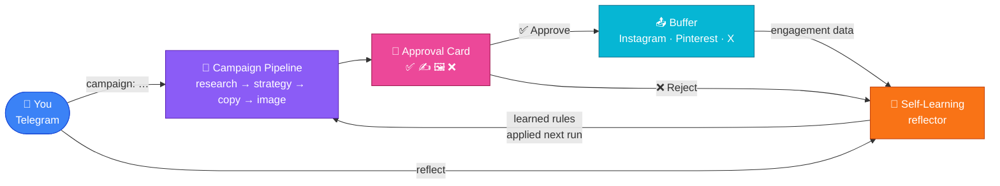

# Cladlygo Marketing Agent

> An automated, self-learning social content pipeline built on the [Google Agent Development Kit (ADK)](https://google.github.io/adk-docs/) and Gemini. **Your daily effort: < 5 minutes** (mobile approval taps only).

It researches what's worth talking about, plans a coherent campaign, writes and designs platform-native posts through a critic loop, guards against spam, sends each draft to your phone for a one-tap approval, publishes via Buffer, tracks real engagement, and learns from everything — without you editing a line of code.

The system is **brand- and domain-agnostic**: every brand assumption and the content data source are configurable via environment variables.

---

## How it works

```
You (Telegram)  →  campaign pipeline  →  Telegram approval cards
    → tap Approve / Reject / Regen  →  Buffer publish  →  engagement tracked
    → message "reflect"  →  agent learns, improves itself
```



> For the full technical deep-dive — stage-by-stage diagrams, Firestore data model, API reference, and architecture decisions — see **[docs/ARCHITECTURE.md](docs/ARCHITECTURE.md)**.

---

## Stack

| Layer | Technology |
|---|---|
| Agent runtime | Google ADK 2.x |
| LLM | Gemini 2.5 Flash / Flash-Lite / Flash Image |
| Database | Firestore |
| Object storage | Cloud Storage |
| Compute | Cloud Run (scale-to-zero) |
| Scheduling | Cloud Tasks (one-time per campaign) |
| Approval UI | Telegram bot |
| Publishing | Buffer (Instagram · Pinterest · X) |

**Monthly cost: ~$13–15** — see [cost breakdown](docs/ARCHITECTURE.md#13-models--cost).

---

## Quick start

### 1. Prerequisites

- A Google Cloud account with billing enabled
- [gcloud CLI](https://cloud.google.com/sdk/docs/install)
- Python 3.11+

```bash
gcloud auth login
gcloud auth application-default login
```

### 2. Configure

```bash
cp .env.example .env
# Fill in: GOOGLE_CLOUD_PROJECT, Telegram bot token + chat ID,
# Buffer access token + channel IDs.
# Everything else has working defaults.
```

### 3. Deploy (first time)

```bash
bash go.sh
```

`go.sh` creates the GCP project, enables APIs, provisions Firestore + GCS bucket + service account, deploys to Cloud Run, creates the Cloud Tasks queue, and registers the Telegram webhook. One command, ~5 minutes.

### 4. Redeploy after code changes

```bash
bash deploy.sh
```

---

## Make it your own

### Brand

All brand values are environment variables with neutral defaults in [`marketing_agent/config.py`](marketing_agent/config.py):

| Variable | Controls |
|---|---|
| `BRAND_NAME` | Your brand / product name |
| `BRAND_TAGLINE` | One-line description |
| `BRAND_AUDIENCE` | Who you're talking to |
| `BRAND_DOMAIN` | The subject area your content lives in |
| `BRAND_COLORS` | Visual identity for generated images |
| `BRAND_VOICE` | Tone of voice for all copy |
| `RANKING_CRITERIA` | How topics are ranked (comma-separated) |
| `PLATFORMS` | Target platforms (comma-separated) |

### Bring your own data source

Set `SOURCE_PROVIDER` to one of:

| Value | Provider | Notes |
|---|---|---|
| `rss` *(default)* | RSS / Atom feeds | Configure `SOURCE_FEEDS` (comma-separated URLs) |
| `vectordb` | Postgres + pgvector | Point `WARDROBE_DB_*` settings at your knowledge base |
| `none` | No external signals | Agents work from brand context only |
| `module:Class` | Custom implementation | Any class implementing the `SourceProvider` contract |

To write a fully custom provider, implement the contract in [`marketing_agent/sources/base.py`](marketing_agent/sources/base.py) and set `SOURCE_PROVIDER=your_module:YourProvider`.

---

## Approval

After a pipeline run, one Telegram card arrives per post:

| Button | What happens |
|---|---|
| ✅ Approve | Post queued for the next publish slot (9 AM / 12 PM / 3 PM / 6 PM / 9 PM IST) |
| ✍️ Regen Text | Caption rewritten by Flash with current learned rules applied |
| 🖼 Regen Visual | New image generated, new card sent |
| ❌ Reject | Logged with a reason — feeds the self-learning reflector |

---

## Self-learning

Send `reflect` in Telegram to trigger the reflector agent. It mines your rejection reasons and engagement data, writes new prompt rules to Firestore, and retires rules that stopped working. Every subsequent pipeline run is smarter.

| Command | What it does |
|---|---|
| `reflect` | Run the self-learning reflector |
| `rules` | List all active learned rules with IDs |
| `forget <id>` | Retire a specific rule immediately |

---

## Testing

```bash
# Check the configured source provider works (no GCP needed for rss / none)
python scripts/test_pipeline.py --mode sources

# Run agents against live Gemini, mocking all I/O (no real side-effects)
python scripts/test_pipeline.py --mode reasoning --phase 2

# Inspect the effective prompt each agent receives (offline, no GCP)
python scripts/test_pipeline.py --mode prompts

# Run the reflector against live Gemini from a mocked feedback fixture
python scripts/test_pipeline.py --mode reflect

# Full end-to-end — real images, real Firestore, real Telegram cards (~$0.04)
python scripts/test_pipeline.py --mode full
```

---

## Pipeline modes

Selectable via `PIPELINE_MODE`:

| Mode | Description |
|---|---|
| `department` *(default)* | Full multi-agent department pipeline (research → campaign → critic loop) |
| `phase1` | Simple linear baseline in `marketing_agent/pipeline.py` |

---

## Security

- `.env` is gitignored. **Never commit real credentials.** Only `.env.example` goes to git.
- If you fork from a private deployment, rotate the Telegram bot token, Buffer token, database passwords, and any API keys before making the repo public.
- All `/run/*` endpoints verify `X-Scheduler-Token` against `SCHEDULER_SECRET` (generated by `go.sh`).
- The Buffer token must carry the `insights:read` scope for engagement metrics to work.

---

## Troubleshooting

**`go.sh` says "gcloud is not authenticated"**
→ Run `gcloud auth login && gcloud auth application-default login`, then retry.

**Telegram cards not arriving**
→ `gcloud run logs tail cladlygo-agent --region us-central1`

**Images not generating**
→ Nano Banana requires `us-central1`. Check `GOOGLE_CLOUD_LOCATION` in `.env`.

**Buffer publish fails (401)**
→ Personal API keys expire yearly. Get a new one at `publish.buffer.com/settings/api`.

**Engagement metrics are all zero / null**
→ Buffer refreshes metrics ~once daily. Wait 24h after a post goes live. Also confirm the token has `insights:read` scope.

**`reflect` returns "no rules written"**
→ Normal for the first 1–2 weeks. The evidence threshold requires patterns to repeat across at least 3 separate feedback events before a rule is written.

---

## License

[MIT](LICENSE).
