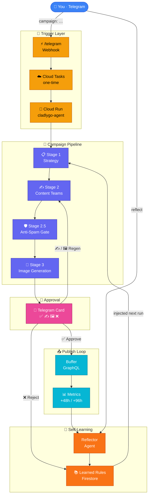
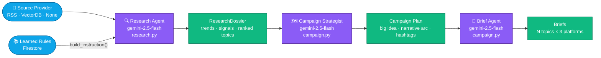
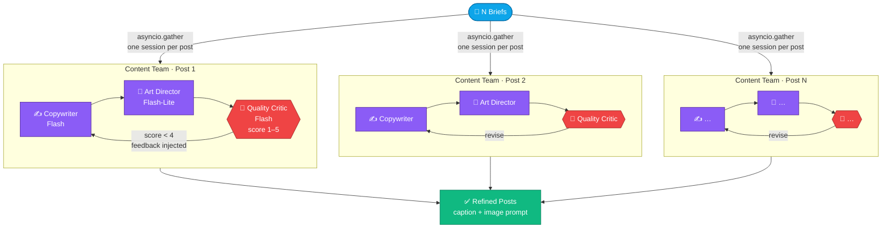
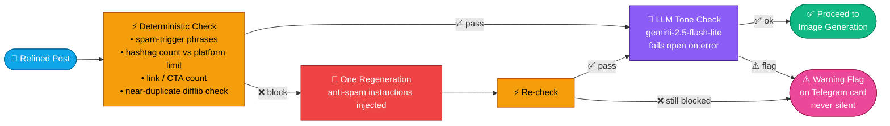
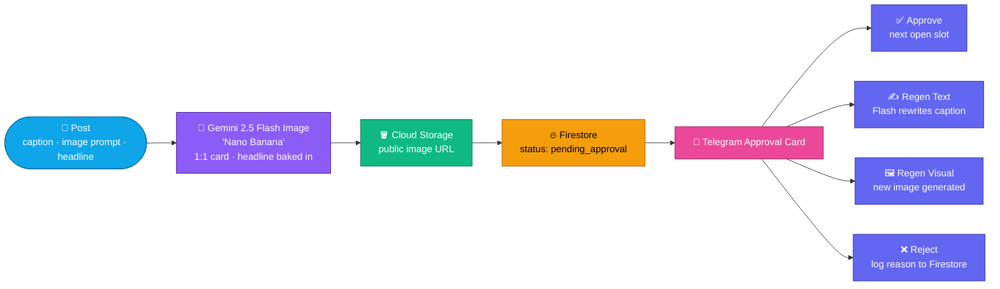
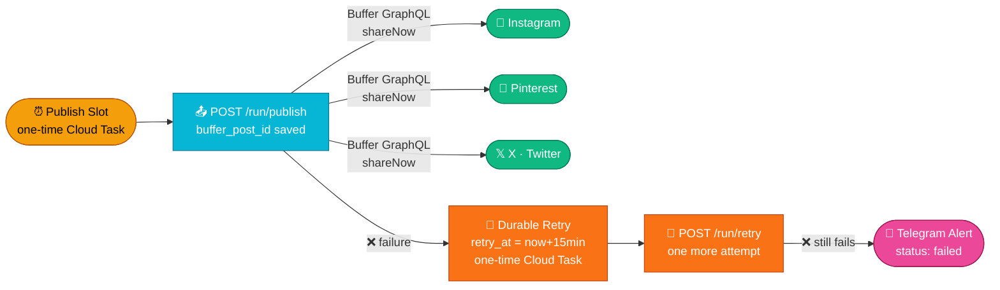
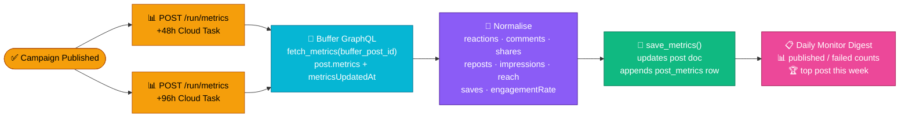
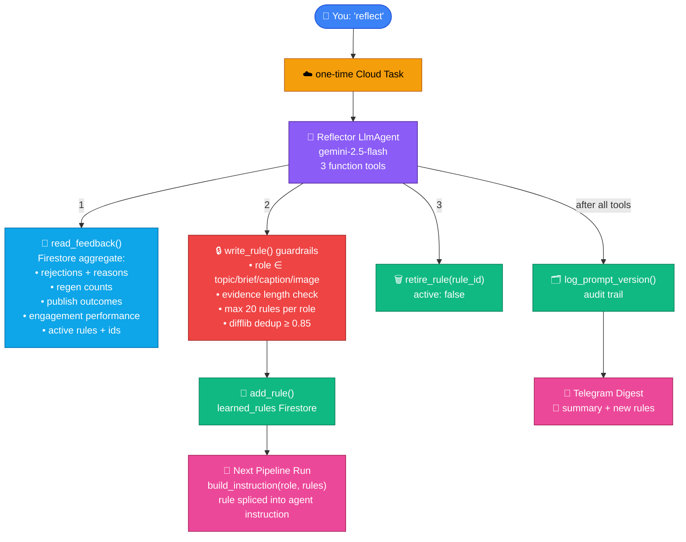
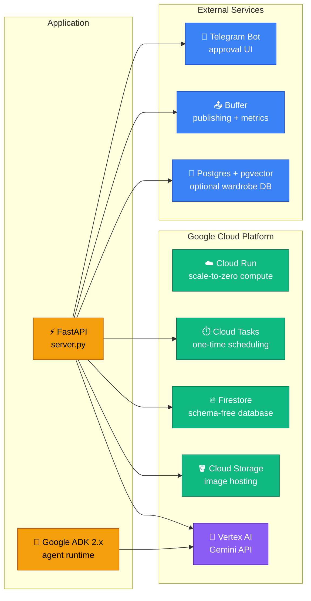
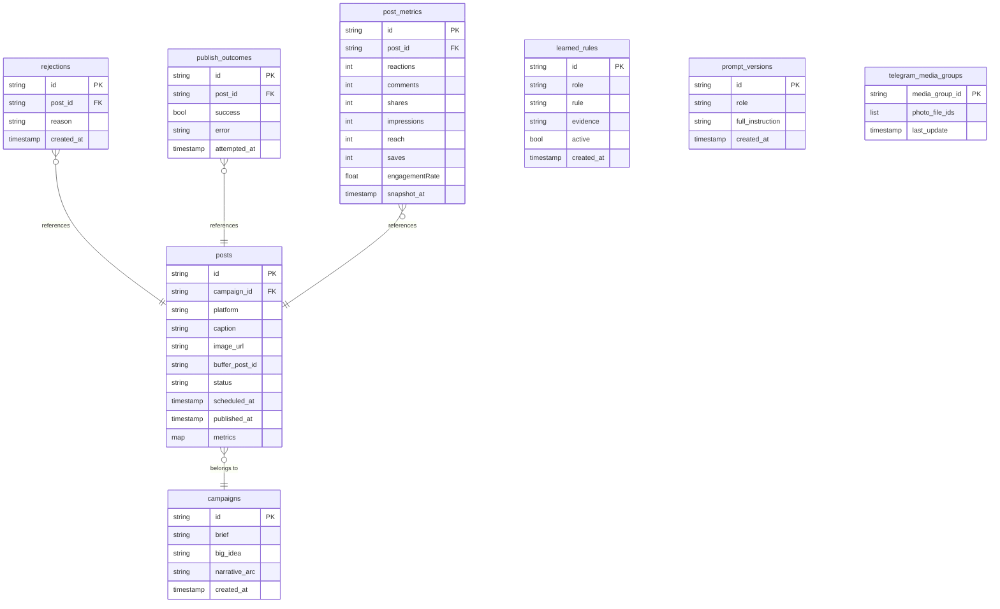

# Architecture — Cladlygo Marketing Agent

> **Your daily effort: < 5 minutes.** The rest is fully automated.

This document is the single authoritative reference for the system's design, data flow, infrastructure choices, and internal decisions. For setup instructions, see the [README](../README.md).

---

## Contents

1. [System at a Glance](#1-system-at-a-glance)
2. [Stage 1 — Strategy Pipeline](#2-stage-1--strategy-pipeline)
3. [Stage 2 — Content Teams (Parallel)](#3-stage-2--content-teams-parallel)
4. [Stage 2.5 — Anti-Spam Guardrail](#4-stage-25--anti-spam-guardrail)
5. [Stage 3 — Image Generation & Approval](#5-stage-3--image-generation--approval)
6. [Stage 4 — Publishing & Durable Retry](#6-stage-4--publishing--durable-retry)
7. [Stage 5 — Engagement Tracking](#7-stage-5--engagement-tracking)
8. [Stage 6 — Self-Learning Reflector](#8-stage-6--self-learning-reflector)
9. [Infrastructure & Stack](#9-infrastructure--stack)
10. [Firestore Data Model](#10-firestore-data-model)
11. [HTTP API Reference](#11-http-api-reference)
12. [File Map](#12-file-map)
13. [Models & Cost](#13-models--cost)
14. [Architecture Decisions](#14-architecture-decisions)

---

## 1. System at a Glance

The entire system is triggered by a single Telegram message and runs without further human input until approval cards arrive on your phone.



---

## 2. Stage 1 — Strategy Pipeline

One `SequentialAgent` session. All three sub-agents share state through ADK's output keys — the research dossier flows directly into the campaign plan, and the campaign plan flows into the briefs.



**What each agent produces:**

| Agent | Output | Key fields |
|---|---|---|
| Research | `ResearchDossier` | trend signals, audience values, do/avoid, ranked topics |
| Campaign Strategist | `CampaignPlan` | big idea, narrative arc, hashtag rotation, anti-spam guidance |
| Brief | `Brief` × (N×3) | hook, angle, key points, visual concept, eyebrow, headline, CTA |

---

## 3. Stage 2 — Content Teams (Parallel)

Each brief gets its own isolated `LoopAgent` running in its own `InMemoryRunner` session, fanned out via `asyncio.gather`. Isolation means one failing post cannot corrupt the others and avoids ADK state-key collisions.



**Loop mechanics:**

| Step | Agent | Description |
|---|---|---|
| 1 | Copywriter | Writes the caption. On iterations 2+ reads critic feedback from state. |
| 2 | Art Director | Writes the image-generation prompt for the visual concept. |
| 3 | Quality Critic | Scores 1–5 against brief, brand voice, platform fit. Calls `exit_loop` when score ≥ `CRITIC_PASS_SCORE` (default 4). Uses plain-text output because it calls a tool (`output_schema` incompatible). |

Max iterations: `CRITIC_MAX_ITERATIONS` (default 3).

---

## 4. Stage 2.5 — Anti-Spam Guardrail

A two-stage gate applied to every post before image generation. Fails open on LLM errors (the deterministic check always runs).



---

## 5. Stage 3 — Image Generation & Approval

`Gemini 2.5 Flash Image` renders the headline text directly onto the generated scene in a single API call. No external compositor or separate text-overlay service is needed.



**Approval slots** (configurable): 9 AM · 12 PM · 3 PM · 6 PM · 9 PM IST

| Button | Firestore update |
|---|---|
| ✅ Approve | `status → pending_publish`, `scheduled_at → next slot` |
| ✍️ Regen Text | Caption rewritten with current learned rules, card refreshed |
| 🖼 Regen Visual | New image generated, new card sent |
| ❌ Reject | `status → rejected`, `reason` logged to `rejections` collection |

---

## 6. Stage 4 — Publishing & Durable Retry

Publishing is just-in-time: a one-time Cloud Task fires at each post's scheduled slot. Buffer's `shareNow` mode publishes immediately across all connected platforms.



---

## 7. Stage 5 — Engagement Tracking

Buffer normalises engagement metrics across all three platforms. Two snapshots are taken per campaign because Buffer refreshes ~once daily and very fresh posts return empty metrics.



---

## 8. Stage 6 — Self-Learning Reflector

The reflector is an autonomous `LlmAgent` — it decides which tools to call; you don't define the workflow. Guardrails live inside the `write_rule` tool, not in the prompt, so a chatty model cannot bypass them.



**Human override commands:**

| Telegram message | What happens |
|---|---|
| `reflect` | Triggers the self-learning reflector |
| `rules` | Lists all active learned rules with IDs |
| `forget <id>` | Retires a specific rule immediately |

---

## 9. Infrastructure & Stack



| Layer | Technology | Reason |
|---|---|---|
| Agent runtime | Google ADK 2.x | Sequential, Loop, and Parallel agent primitives |
| LLM | Gemini 2.5 Flash / Flash-Lite / Flash Image | Single ecosystem; lowest per-token cost at each task tier |
| Image generation | Gemini 2.5 Flash Image ("Nano Banana") | Text-on-image in one call, no compositor needed |
| Database | Firestore | Schema-free, serverless, zero-maintenance |
| Object storage | Cloud Storage | Public-URL image hosting for Buffer |
| Compute | Cloud Run | Scale-to-zero, one-command deploy |
| Scheduling | Cloud Tasks (one-time per campaign) | No wasted recurring runs |
| Approval UI | Telegram bot | No app to install, instant mobile delivery |
| Publishing | Buffer GraphQL API | Single token for Instagram + Pinterest + X |
| Engagement | Buffer metrics API | Normalised across platforms, no extra OAuth |

**Monthly cost: ~$13–15** — image generation dominates (~$10.50); all text agents together are ~$3–5.

---

## 10. Firestore Data Model



| Collection | Written by | Read by | Purpose |
|---|---|---|---|
| `posts` | pipeline, approval handler | publisher, reflector | Post queue + approval state machine |
| `campaigns` | orchestrator | — | Campaign plan archive |
| `rejections` | approval handler | reflector | Human rejection reasons |
| `publish_outcomes` | publisher, retry handler | reflector, monitor | Publish success/failure log |
| `post_metrics` | metrics sweep | reflector, monitor | Buffer engagement time-series |
| `learned_rules` | reflector | all pipeline agents | Active prompt guidelines |
| `prompt_versions` | reflector | audit | Audit trail of every reflection |
| `telegram_media_groups` | approval handler | campaign intake | Multi-image debounce buffer |

---

## 11. HTTP API Reference

All `/run/*` endpoints require `X-Scheduler-Token: <SCHEDULER_SECRET>` in the request header.

| Endpoint | Trigger | Action |
|---|---|---|
| `GET /` | Cloud Run health probe | Returns `{"status": "ok"}` |
| `POST /telegram` | Telegram webhook | Routes updates: campaign intake · button taps · `reflect` / `rules` / `forget` commands |
| `POST /run/campaign` | Cloud Task (per campaign) | Runs the full content pipeline for one campaign brief |
| `POST /run/publish` | Cloud Task (per slot) | Publishes all approved posts whose scheduled slot has arrived |
| `POST /run/retry` | Cloud Task (per failure) | One durable retry for a failed publish (+15 minutes) |
| `POST /run/monitor` | Cloud Task (per campaign, +24h) | Sends a Telegram digest of publish outcomes |
| `POST /run/metrics` | Cloud Task (per campaign, +48h / +96h) | Pulls Buffer engagement metrics for recently published posts |
| `POST /run/reflect` | Cloud Task (on `reflect` command) | Runs the self-learning reflector agent |

---

## 12. File Map

```
server.py                           ← FastAPI entry point (all HTTP endpoints)
│
marketing_agent/
├── config.py                       ← All config, env vars, and defaults
├── prompts.py                      ← Base prompts + build_instruction()
├── schemas.py                      ← Pydantic models for all agent I/O
├── orchestrator.py                 ← Department pipeline (Phase 2, default)
├── pipeline.py                     ← Linear pipeline baseline (Phase 1)
├── guardrails.py                   ← Anti-spam gate (deterministic + LLM)
├── approval.py                     ← Telegram webhook handler + commands
├── publish_runner.py               ← JIT publisher + durable retry
├── sub_agents.py                   ← Phase 1 agent factories
│
├── agents/
│   ├── research.py                 ← Research lead  →  ResearchDossier
│   ├── campaign.py                 ← Campaign strategist + brief agent
│   ├── content_team.py             ← Per-post LoopAgent (copy → art → critic)
│   ├── critic.py                   ← Quality critic (evaluator-optimizer)
│   └── monitor.py                  ← Publish outcomes + engagement digest
│
├── tools/
│   ├── firestore_store.py          ← All Firestore reads/writes
│   ├── publisher.py                ← Buffer GraphQL: publish + fetch_metrics
│   ├── imagen.py                   ← Gemini Flash Image card generation
│   ├── telegram.py                 ← Telegram messaging helpers
│   ├── tasks.py                    ← Cloud Tasks enqueueing
│   ├── gcs.py                      ← Cloud Storage upload
│   ├── llm.py                      ← One-shot Gemini text calls
│   └── sources.py                  ← Source provider dispatch
│
└── sources/
    ├── base.py                     ← SourceProvider abstract contract
    ├── rss.py                      ← RSS/Atom feed reader (default)
    ├── vectordb.py                 ← Postgres + pgvector retrieval
    └── none.py                     ← No-op (brand context only)
│
docs/
└── ARCHITECTURE.md                 ← This file
│
scripts/
├── test_pipeline.py                ← Test runner (sources/reasoning/prompts/reflect/full)
└── discover_wardrobe_db.py         ← Inspect wardrobe DB schema + embedding dimension
│
infra/
└── setup.sh                        ← GCP resource provisioning (called by go.sh)
│
go.sh                               ← First-time full setup (one command)
deploy.sh                           ← Redeploy after code changes
```

---

## 13. Models & Cost

| Model | Used for | Approx. cost |
|---|---|---|
| `gemini-2.5-flash-lite` | Topic ranking, anti-spam tone check, image prompt writing | ~$0.10 / M tokens |
| `gemini-2.5-flash` | Research, campaign planning, copywriting, critic loop, reflection | ~$0.30 / M input · $2.50 / M output |
| `gemini-2.5-flash-image` | Branded card generation (~270 images / month) | ~$0.039 / image |

**Monthly total: ~$13–15**

```
Image generation  ████████████████████████░░░  ~$10.50  (70%)
Text agents       ████████░░░░░░░░░░░░░░░░░░░  ~$3–5    (25%)
Infrastructure    ██░░░░░░░░░░░░░░░░░░░░░░░░░  ~$0–1    (5%)
```

---

## 14. Architecture Decisions

### Google ADK over LangChain / LlamaIndex

ADK's `SequentialAgent`, `LoopAgent`, and `InMemoryRunner` give first-class session state and tool execution without boilerplate. The evaluator-optimizer critic loop (`LoopAgent` + `exit_loop` tool) maps directly to an ADK primitive. LangChain was evaluated but the ADK abstractions aligned better with the multi-stage, multi-role structure needed here.

### Gemini exclusively (no cross-cloud)

Everything runs in one Google ecosystem: Vertex AI → Cloud Run → Firestore → Cloud Tasks → Cloud Storage. No cross-cloud authentication, no extra billing accounts. Flash-Lite for cheap structured ranking; Flash for brand copywriting and reflection; Flash Image ("Nano Banana") bakes the headline directly onto the generated image — replacing two old vendors (Replicate + HCTI) with one API call.

### Cloud Tasks (one-time) over Cloud Scheduler (recurring crons)

Campaigns are Telegram-initiated, not time-scheduled. Each campaign enqueues its own one-time downstream tasks (publish sweeps, monitor, metrics sweeps). The service scales to zero between campaigns, there are no wasted runs when nothing is queued, and scheduling is deterministic per campaign rather than global.

### Buffer over native platform APIs

Buffer brokers all three platforms (Instagram, Pinterest, X) with a single bearer token. X's native API has no free tier as of 2026 ($0.005/read); Instagram and Pinterest both require separate OAuth apps. Buffer normalises the GraphQL publish + engagement metrics interfaces across all three, so one code path handles all platforms.

### Firestore over Postgres / Supabase

Schema-free documents match the varied shapes of posts, campaigns, rules, and time-series metrics without migrations. The serverless scaling and zero-maintenance story fits a system running on Cloud Run (scales to zero). Real-time capabilities aren't used here but cost nothing extra.

### Isolated sessions per post (Stage 2)

An ADK agent can only have one parent. Sharing one session for parallel fan-out causes state-key collisions. One `InMemoryRunner` per post means one post failing doesn't kill the others, and each critic loop runs against its own brief's context only.

### Guardrails inside tools, not prompts

The `write_rule` guardrails (role validation, evidence length, max rules, dedup) live inside the tool function, not in the system prompt. A chatty or misaligned model cannot bypass them by rephrasing. The same principle applies to `build_instruction()` — rules are spliced in at build time, keeping the base prompt auditable and version-controlled.
